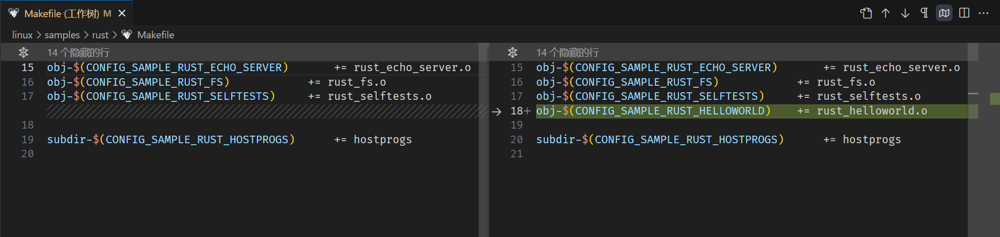

### 作业1：编译Linux内核


### 作业2：对Linux内核进行一些配置


### 作业3：使用rust编写一个简单的内核模块并运行




```rs
// cat rust_helloworld.rs

use kernel::prelude::*;

module! {
  type: RustHelloWorld,
  name: "rust_helloworld",
  author: "whocare",
  description: "hello world module in rust",
  license: "GPL",
}

struct RustHelloWorld {}

impl kernel::Module for RustHelloWorld {
    fn init(_name: &'static CStr, _module: &'static ThisModule) -> Result<Self> {
        pr_info!("Hello World from Rust module\n");
        Ok(RustHelloWorld {})
    }
}

impl Drop for RustHelloWorld {
    fn drop(&mut self) {
        pr_info!("Hello World from Rust module (exit)\n");
    }
}
```


### 作业4：为e1000网卡驱动添加remove代码


```rs
#[vtable]
impl net::DeviceOperations for NetDevice {
    type Data = Box<NetDevicePrvData>;

    fn stop(_dev: &net::Device, data: &NetDevicePrvData) -> Result {
        pr_info!("Rust for linux e1000 driver demo (net device stop)\n");

        let irq_handler_ptr = data
            ._irq_handler
            .load(core::sync::atomic::Ordering::Relaxed);

        if !irq_handler_ptr.is_null() {
            unsafe {
                Box::from_raw(irq_handler_ptr);
            }

            // 这行代码可加可不加，测试样例都能过
            data._irq_handler
                .store(core::ptr::null_mut(), core::sync::atomic::Ordering::Relaxed)
        }

        Ok(())
    }
}

struct E1000Drv {}

impl pci::Driver for E1000Drv {
    // The Box type has implemented PointerWrapper trait.
    type Data = Box<E1000DrvPrvData>;

    fn probe(dev: &mut pci::Device, id: core::option::Option<&Self::IdInfo>) -> Result<Self::Data> {

        // === probe 中间代码省略 ===

        Ok(Box::try_new(E1000DrvPrvData {
            // Must hold this registration, or the device will be removed.
            _netdev_reg: netdev_reg,
            bars,
            dev_ptr: dev.as_ptr(),
            irq,
        })?)
    }
}

struct E1000DrvPrvData {
    _netdev_reg: net::Registration<NetDevice>,
    bars: i32,
    dev_ptr: *mut bindings::pci_dev,
    irq: u32,
}

impl Drop for E1000DrvPrvData {
    fn drop(&mut self) {
        pr_info!("drop E1000DrvPrvData\n");
        self.disable_device();
        self.release_selected_regions();
    }
}

unsafe impl Send for E1000DrvPrvData {}
unsafe impl Sync for E1000DrvPrvData {}

impl E1000DrvPrvData {
    fn disable_device(&self) -> Result {
        unsafe { bindings::pci_disable_device(self.dev_ptr) };
        Ok(())
    }

    fn release_selected_regions(&self) -> Result {
        unsafe { bindings::pci_release_selected_regions(self.dev_ptr, self.bars) };
        Ok(())
    }
}

impl driver::DeviceRemoval for E1000DrvPrvData {
    fn device_remove(&self) {
        pr_info!("Rust for linux e1000 driver demo (device_remove)\n");
    }
}
```

### 作业5：注册字符设备


```rs
impl file::Operations for RustFile {
    type Data = Box<Self>;

    fn write(
        this: &Self,
        _file: &file::File,
        reader: &mut impl kernel::io_buffer::IoBufferReader,
        _offset: u64,
    ) -> Result<usize> {
        let mut len = reader.len();

        if len > GLOBALMEM_SIZE {
            len = GLOBALMEM_SIZE
        }

        let buf = &mut *this.inner.lock();
        reader.read_slice(&mut buf[..len])?;

        Ok(len)
    }

    fn read(
        this: &Self,
        _file: &file::File,
        writer: &mut impl kernel::io_buffer::IoBufferWriter,
        offset: u64,
    ) -> Result<usize> {
        let offset = offset as usize;

        if offset >= GLOBALMEM_SIZE {
            return Ok(0);
        }

        let buf = &mut *this.inner.lock();
        writer.write_slice(&buf[offset..])?;

        Ok(buf.len())
    }
}
```
